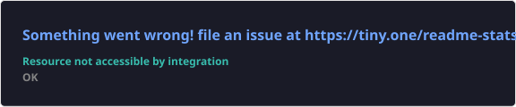

<!-- ========================================================= -->
<!--                 CINEMATIC DEVELOPER PROFILE                -->
<!-- ========================================================= -->

  <picture>
    <source srcset="https://raw.githubusercontent.com/BORUTOUZUMAKI07/BORUTOUZUMAKI07/main/assets/sriram_dynamic_hero_v2.gif?v=2" type="image/gif">
    
  </picture>

  

  

  
  
  

---

## 👋 About Me

I'm **Sriram**, a BTech engineering student and full-stack developer focused on **AI/LLM engineering, intelligent applications, RAG, agentic systems, and production ML infrastructure**.

I like building systems that go beyond demos: modern frontends, production APIs, AI agents, retrieval pipelines, observability, CI/CD, distributed services, and developer tooling.

### What I build

- 🤖 **AI / LLM systems** — RAG, agents, LangChain, LangGraph, MCP, tool use and evaluation
- 🌐 **Full-stack products** — React, Next.js, TypeScript and Python backends
- ⚡ **Backend systems** — FastAPI, Flask, Django, PostgreSQL, Redis, MongoDB and event-driven services
- 🧠 **ML engineering** — PyTorch, NLP, computer vision, model monitoring and drift detection
- ☁️ **Production engineering** — Docker, Kubernetes, GitHub Actions, MLOps, observability and CI/CD

---

## 🚀 What I Build

  
  
  
  
  
  

  AI Copilots • Agentic AI • RAG • Full-Stack SaaS • Distributed Systems • MLOps • Computer Vision

---

## 🛠️ Tech Stack

### 🎨 Frontend

  

  TypeScript • JavaScript • React • Next.js • HTML • CSS • Tailwind CSS • shadcn/ui

### ⚙️ Backend

  

  Python • FastAPI • Django • Flask • PostgreSQL • MongoDB • Redis • Kafka • SQLAlchemy

### 🧠 AI / ML / LLM

  

  Transformers • LangChain • LangGraph • RAG • MCP • Agentic AI • Embeddings • Reranking • Evaluation • Guardrails • Computer Vision

### ☁️ DevOps / MLOps / Observability

  

  Docker • Kubernetes • GitHub Actions • MLflow • DVC • Prefect • Kubeflow • Weights & Biases • Grafana • Prometheus • New Relic • OpenTelemetry

---

## 🔥 Featured Projects

  
  

  
  

### 🔗 LinkForge

Enterprise URL-shortening platform with **multi-tenant workspaces, click analytics, QR codes, webhooks, API keys, team collaboration, and event-driven architecture**.

**Stack:** Next.js • React • TypeScript • FastAPI • SQLAlchemy • PostgreSQL/Neon • MongoDB • Redis • Kafka • Schema Registry • OpenTelemetry • New Relic • Docker • GitHub Actions

  <a href="https://github.com/BORUTOUZUMAKI07/url-shortner">SOURCE</a> ·
  <a href="https://url-shortner-peay.vercel.app">LIVE FRONTEND</a>

### 🧠 Nexus AI Assistant

Production-grade AI copilot built with a **FastAPI + LangGraph backend and Next.js frontend**, including agent orchestration, hybrid RAG, HITL tool approvals, plan mode, memory, organizations/sharing, audio, MCP tool execution, artifacts, admin observability and prompt regression testing.

**Stack:** FastAPI • LangGraph • Next.js • PostgreSQL/pgvector • Qdrant • Redis • Celery • MCP • RAG • Docker • CI/CD

  <a href="https://github.com/BORUTOUZUMAKI07/nexus-ai-assistant">SOURCE</a>

### 🏛️ AI Civic Issue Monitoring

AI-powered civic intelligence system for **Vadodara Municipal Corporation**, combining computer vision for potholes and garbage, issue classification, LangGraph workflows, real-time drift detection, SLA monitoring and a Next.js dashboard.

**Stack:** FastAPI • Next.js • PyTorch • MobileNetV2 • LangGraph • PostgreSQL/pgvector • MongoDB • Redis • Prefect • Docker • DVC • New Relic

  <a href="https://github.com/BORUTOUZUMAKI07/ai-civic-issue-monitoring">SOURCE</a>

---

## 🧩 Engineering Focus

| Area | Focus |
|---|---|
| 🤖 **AI Engineering** | LLM applications, RAG, agents, tool calling, MCP, evaluation |
| 🧠 **ML Engineering** | NLP, computer vision, PyTorch, training pipelines, drift detection |
| 🌐 **Full Stack** | Next.js, React, TypeScript, FastAPI, Django, Flask |
| 🗄️ **Data** | PostgreSQL, MongoDB, Redis, Kafka, pgvector, Qdrant |
| ⚙️ **MLOps** | MLflow, DVC, Prefect, Docker, Kubernetes, CI/CD |
| 📡 **Observability** | OpenTelemetry, New Relic, Grafana, Prometheus |
| 🏗️ **Architecture** | APIs, distributed systems, event-driven systems, caching, queues |

---

## 📊 GitHub Activity

  

  
  

  

---

## 🐍 Contribution Activity

  

---

## 🔭 Currently Building

  🤖 Production AI Agents &nbsp; • &nbsp;
  🧠 Advanced RAG Systems &nbsp; • &nbsp;
  ⚡ Full-Stack AI Applications

  🏗️ Distributed Backend Systems &nbsp; • &nbsp;
  📊 AI / ML Observability &nbsp; • &nbsp;
  ☁️ Production MLOps Infrastructure

---

  

<h2 align="center">⚡ BUILD • EVOLVE • SHIP ⚡</h2>

  <i>Turning ideas into systems that actually work.</i>

---

## 🌐 Connect With Me

  
  
  

  <strong>Let's build something meaningful.</strong>

